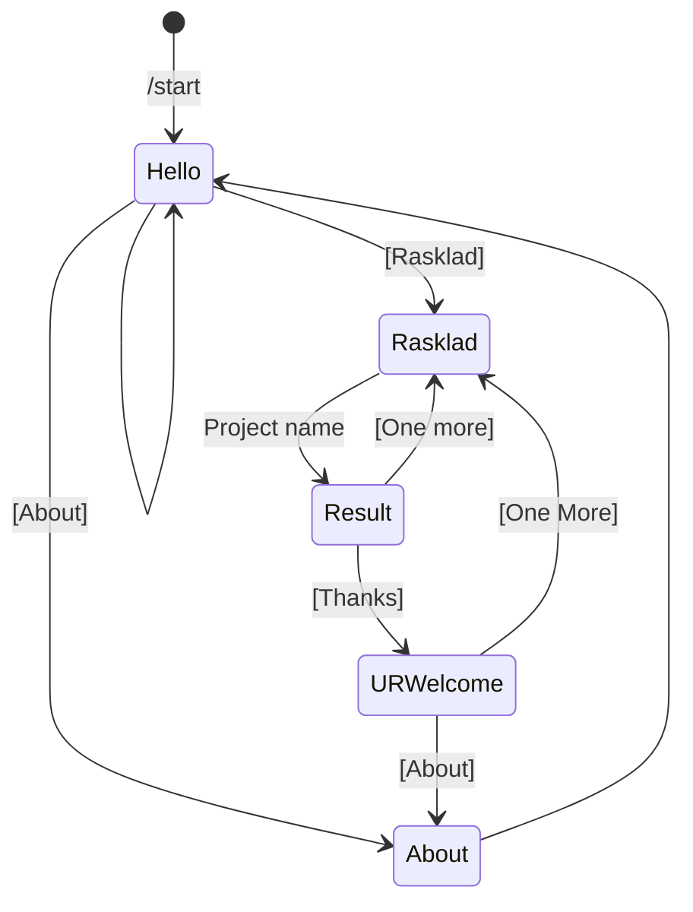

# BotTarolog

## User flow chart

```mermaid
    stateDiagram
        [*] --> Hello: /start
        Hello --> Hello
        Hello --> About: [About]
        About --> Hello
        Hello --> Rasklad: [Rasklad]
        Rasklad --> Result: Project name
        Result --> URWelcome: [Thanks]
        Result --> Rasklad: [One more]
        URWelcome --> About: [About]
        URWelcome --> Rasklad: [One More]
```

## TODO

- sentry
- metrics? list of service users, maybe count of messages?